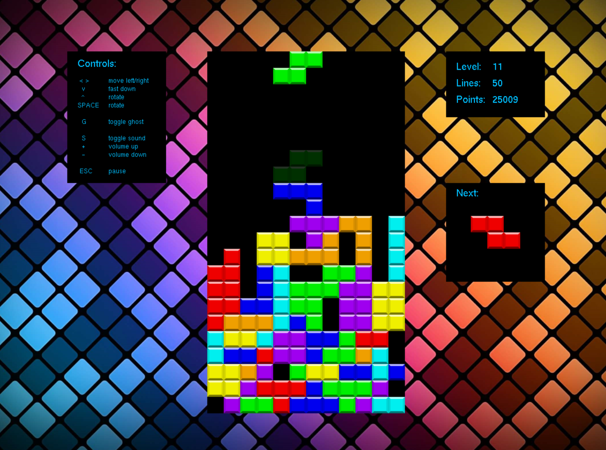

# Falling Blocks

A game with falling blocks in different shapes. The goal is to create full lines that will disappear afterwards.

This project was created for self-educational purposes only, not intended to be sold anywhere.

## Engine

The engine is self written in C# / .net Framework using OpenGL or GDI (WinForms) for rendering.

# Example Screenshot

# Used Libraries

## freeglut
http://freeglut.sourceforge.net/

License: X-Consortium license

## TAO Framework - FreeGlut / OpenGL
https://sourceforge.net/projects/taoframework/

License: [MIT License](FallingBlocks.Engine.Windows/lib/taoframework-2.1.0/COPYING)

## NAudio
https://github.com/naudio/NAudio

License: [MIT License](FallingBlocks.Engine.Windows/lib/NAudio/license.txt)

# Used Resources

## Background Image
https://wallpapercave.com/w/wp2675366

## Cube Blocks
https://www.freepngimg.com/png/83676-tetromino-tetris-square-friends-angle-hq-image-free-png

## Theme Song

https://www.free-stock-music.com/myuu-tetris-dark-version.html

Tetris (Dark Version) by Myuu | https://soundcloud.com/myuu
Music promoted by https://www.free-stock-music.com
Creative Commons Attribution 3.0 Unported License
https://creativecommons.org/licenses/by/3.0/deed.en_US

# License

This project is licensed under [MIT license](LICENSE).

External sources see list above.

## Important Note

This was originally created in 2015 as part of a larger suite of self-written games by multiple people, called "SSTSS". That whole suite is not published publicly.

Credits to parts of the original engine go to:
* Michael Kurz
* Michael Lechner

Now in 2021 I have only extracted my game from that suite, with major reworks to the game and the engine to not have licensed stuff here.
